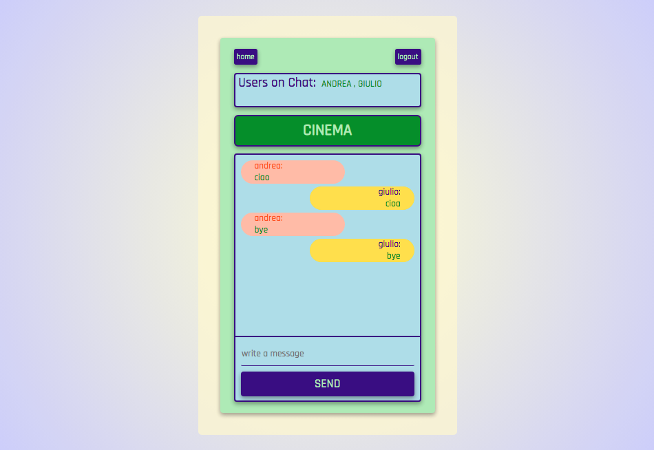

# Node Initial Project

**Nota: aquesta és la branca sockets**

## About The Project




This is a Chat-App, part of the IT-Academy Bootcamp NodeJS Development. 
User can sign-up via username and password. Once authenticated, you can create or join rooms to chat with other people. 
Only the user that has created a room can delete it. 
User can see the other users connected in a room.

### Built With


* Node.js
* Express
* MongoDB
* Socket.io
* React
* JWT


<!-- GETTING STARTED -->
## Getting Started

The app has independent client and server 

### Server Installation

1. Head to the 'server' folder

2. Install NPM packages
   ```sh
   npm install
   ```
   
3. If you want, you can replace the mongoDB URI in .env_template file, default value localhost:27017
   ```js
    MONGODB_URI=YOUR_MONGO_URI
   ```   
4. Rename  `.env_template` to `.env`

5. Run the server. Will run on port 5000
   ```sh
   npm start
   ```

### Client Installation

1. Head to the 'client' folder

2. Install NPM packages
   ```sh
   npm install
   ```

3. Run the client. Will run on port 3000
   ```sh
   npm start
   ```     

<!-- POSTMAN -->
## Endpoints

POSTMAN collection contains following requests:

- POST /signup  - Body form-urlencoded {key: name, password} 
- POST /login   - Body form-urlencoded {key: name, password} 

- POST /room    - Body form-urlencoded {key: name} 
                - Headers {key: Authorization} paste token from login on {value}
- GET /room/:id     - Params form-urlencoded {key: id} 
                    - Headers {key: Authorization} paste token from login on {value}
- DELETE /room/:id  - Params form-urlencoded {key: id} 
                    - Headers {key: Authorization} paste token from login on {value}
 
